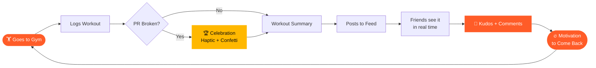
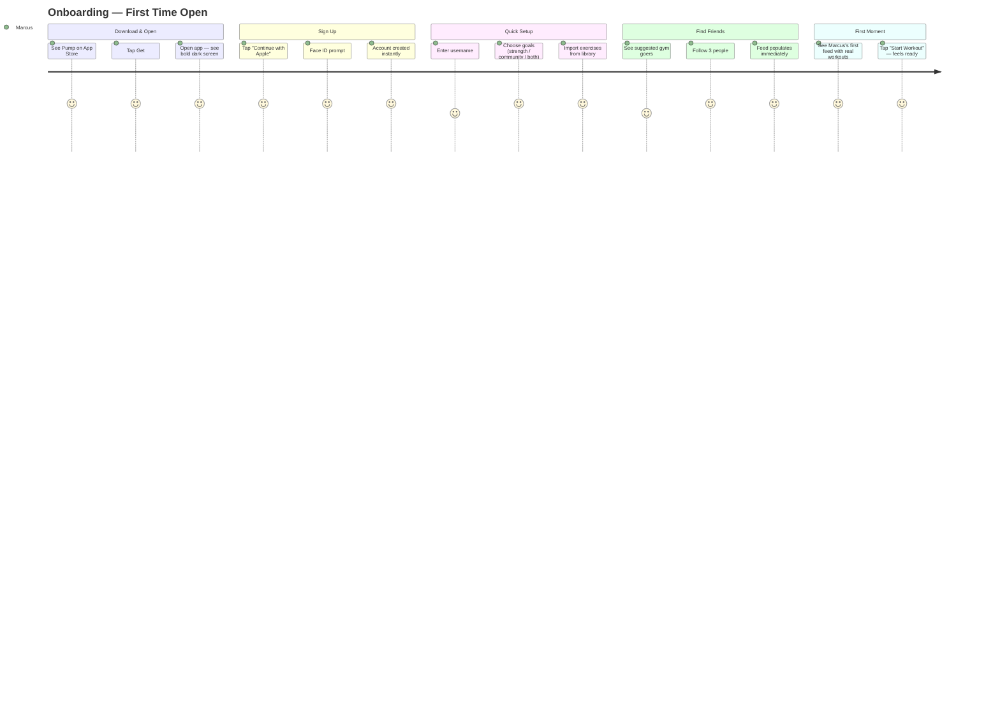
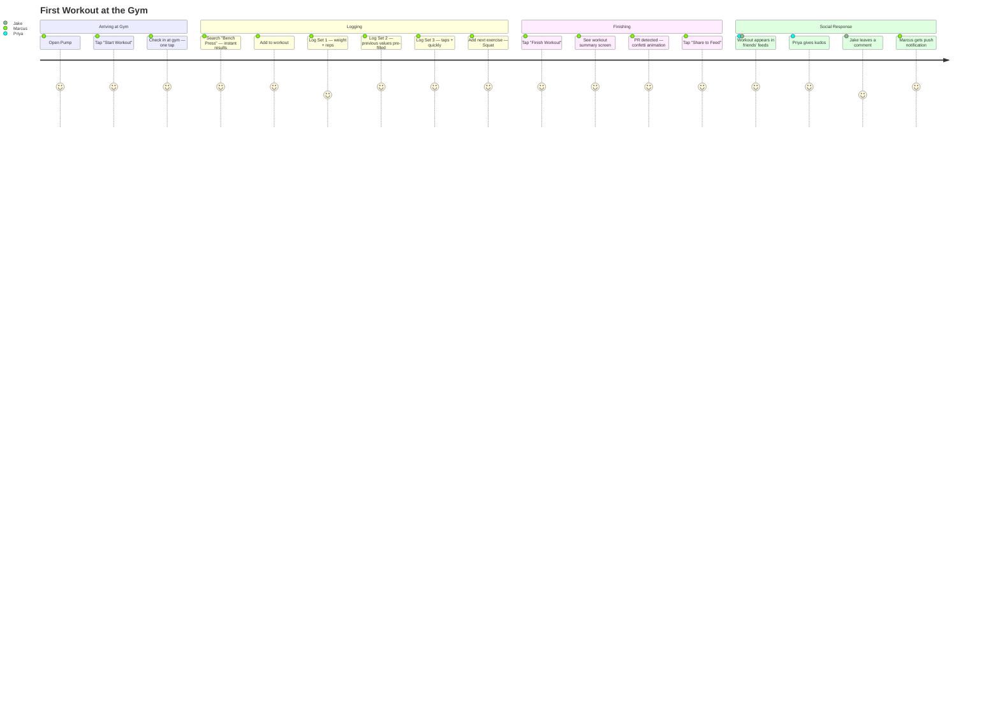
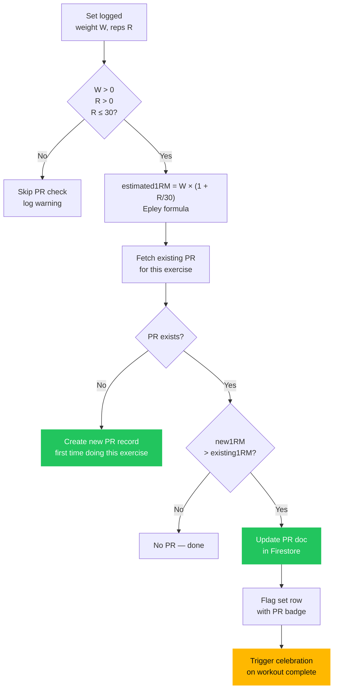
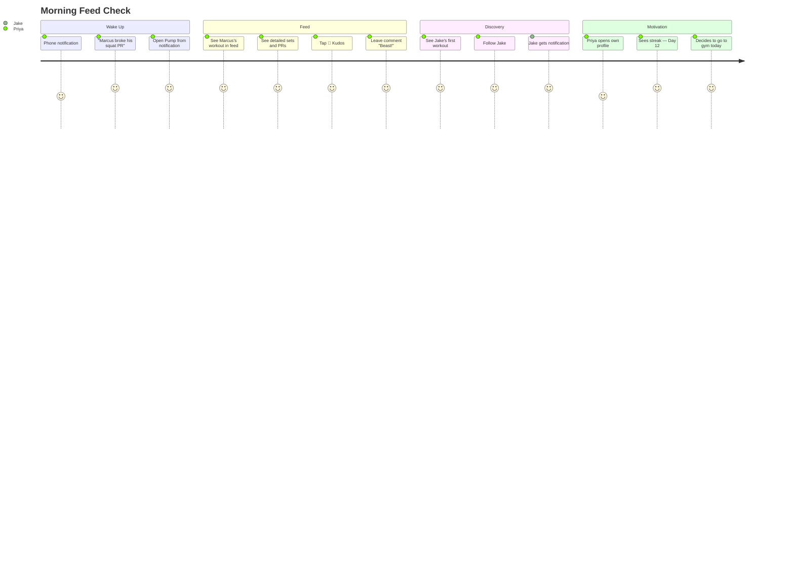
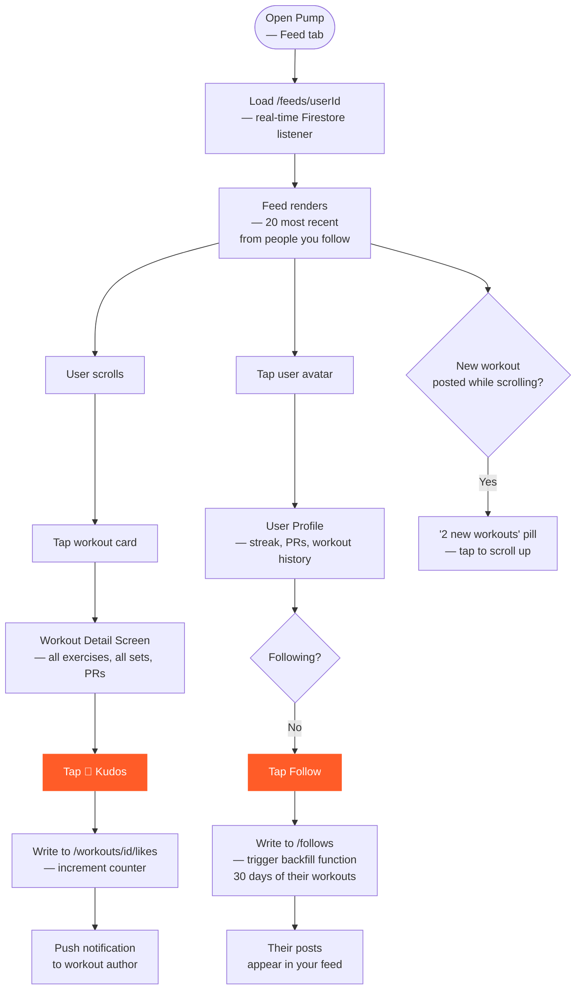
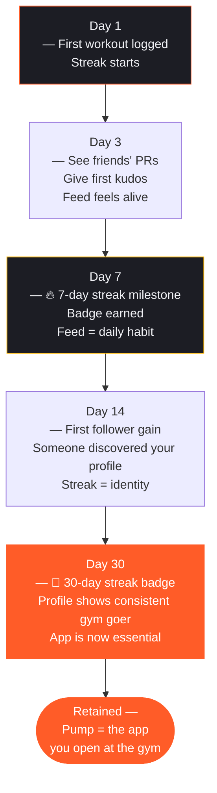
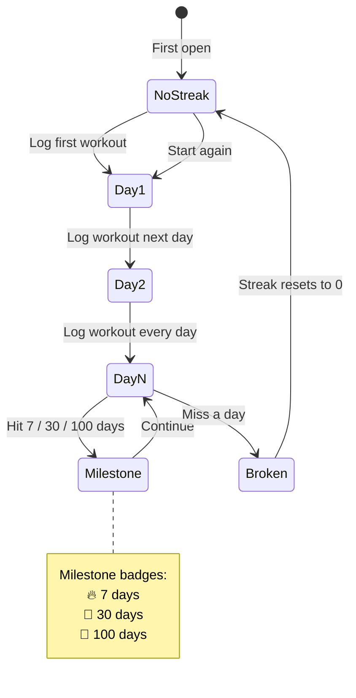
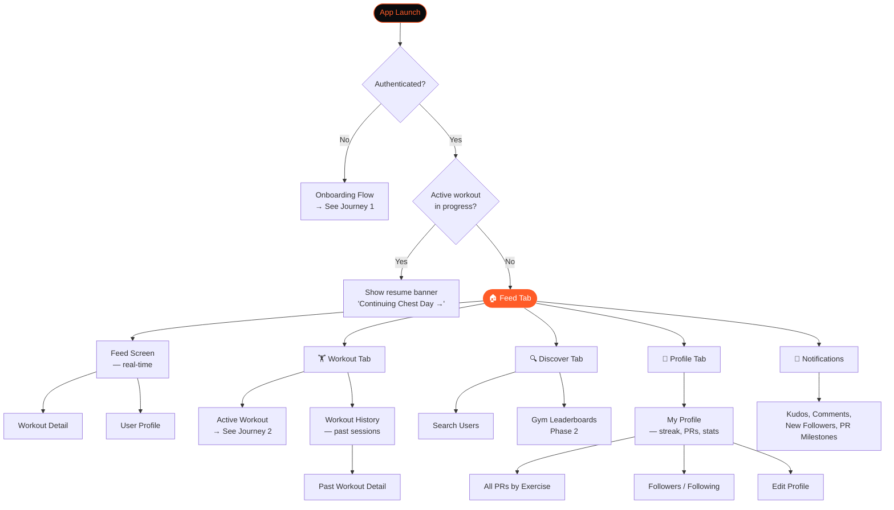

# Pump — User Journey & Experience Map

> **Tagline:** Train together.
> **Platform:** iOS (SwiftUI + Firebase)
> **Core loop:** Log → Break PR → Share → Get kudos → Come back.

---

## Table of Contents

1. [User Personas](#1-user-personas)
2. [The Core Loop](#2-the-core-loop)
3. [Journey 1 — Onboarding](#3-journey-1--onboarding)
4. [Journey 2 — First Workout](#4-journey-2--first-workout)
5. [Journey 3 — Breaking a PR](#5-journey-3--breaking-a-pr)
6. [Journey 4 — Social Feed & Discovery](#6-journey-4--social-feed--discovery)
7. [Journey 5 — Returning User (Retention Loop)](#7-journey-5--returning-user-retention-loop)
8. [Full App Screen Flow](#8-full-app-screen-flow)
9. [Emotion Map](#9-emotion-map)
10. [Brand Tokens Quick Reference](#10-brand-tokens-quick-reference)

---

## 1. User Personas

### The Consistent Gym Goer — *"Marcus"*
> 28 · Software engineer · Trains 4x/week · Uses Hevy to log but nobody sees it

**Goals:** Track progress, see if he's improving, feel part of a gym community.
**Frustrations:** His gym friends don't use the same apps. PRs go unnoticed. No shared space.
**How Pump helps:** Feed shows his PRs to people who get it. Kudos actually mean something.

---

### The Social Fitness Person — *"Priya"*
> 24 · Nurse · Trains 3x/week · Posts gym content to Instagram

**Goals:** Accountability, seeing what her gym crew is doing, celebrating milestones.
**Frustrations:** Instagram isn't built for workout data. Tracking feels disconnected from sharing.
**How Pump helps:** One place for logging and sharing. Her streak drives her to show up.

---

### The Newcomer — *"Jake"*
> 21 · Student · Just started going to the gym · Feels lost

**Goals:** Learn exercises, build consistency, not feel alone.
**Frustrations:** Intimidating. Doesn't know what to track. No accountability.
**How Pump helps:** Exercise library to guide him. Following more experienced gym goers to learn. Streaks give him a reason to come back.

---

## 2. The Core Loop



---

## 3. Journey 1 — Onboarding

**Entry point:** App Store → Download → Open for the first time.
**Goal:** Get the user to their first workout logged in under 3 minutes.



### Onboarding Screen Flow

```mermaid
flowchart TD
    A[Splash Screen\n— PUMP wordmark] --> B[Sign in with Apple\nor Continue with Email]
    B --> C{Auth Success?}
    C -- No --> B
    C -- Yes --> D[Welcome Screen\n— "Your gym, connected."]
    D --> E[Choose Username\n— auto-suggested from name]
    E --> F[Select Goals\n— Strength · Community · Consistency]
    F --> G[Find Your Gym\n— CoreLocation permission prompt]
    G --> H{Location granted?}
    H -- Yes --> I[Nearby gyms listed\n— tap to set home gym]
    H -- No --> I2[Skip — can set later]
    I --> J
    I2 --> J
    J[Find Friends\n— search by username\nor see suggested from contacts]
    J --> K[Follow 1+ person]
    K --> L[🎉 You're in!\n— Feed with real content\n— "Start your first workout" CTA]
    L --> M([Home — Feed Tab])

    style A fill:#0A0B0D,color:#FF5C28,stroke:#FF5C28
    style L fill:#FF5C28,color:#fff,stroke:none
    style M fill:#FF5C28,color:#fff,stroke:none
```

---

## 4. Journey 2 — First Workout

**Trigger:** User arrives at the gym, opens Pump.
**Goal:** Log a full workout in under 5 minutes of total interaction time.



### Active Workout Screen Flow

```mermaid
flowchart TD
    START([Tap "Start Workout"\non Home or Feed]) --> GYM[Gym Check-in Prompt\n— show nearby gyms]
    GYM --> MAIN[Active Workout Screen]
    MAIN --> SEARCH[Search Exercise Library\n— 500+ exercises]
    SEARCH --> ADD[Add Exercise to Workout]
    ADD --> SETVIEW[Exercise Card\n— shows previous best]
    SETVIEW --> LOGSET[Log Set\n— weight / reps / type]
    LOGSET --> PR{PR Detected?}
    PR -- Yes --> CELEBRATE[🏆 Haptic + PR badge\non the set row]
    PR -- No --> NEXTSET
    CELEBRATE --> NEXTSET{More sets?}
    NEXTSET -- Yes --> LOGSET
    NEXTSET -- No, next exercise --> SEARCH
    NEXTSET -- Done --> FINISH[Tap "Finish Workout"]
    FINISH --> SUMMARY[Workout Summary\n— duration, volume, PRs]
    SUMMARY --> CONFETTI{Any PRs?}
    CONFETTI -- Yes --> BOOM[🎊 Full-screen confetti\n+ haptic burst]
    CONFETTI -- No --> PUBLISH
    BOOM --> PUBLISH[Tap "Share to Feed"\nor "Keep Private"]
    PUBLISH --> FEED([Feed — workout visible\nto followers in real time])

    style CELEBRATE fill:#FFB800,color:#0A0B0D,stroke:none
    style BOOM fill:#FFB800,color:#0A0B0D,stroke:none
    style FEED fill:#FF5C28,color:#fff,stroke:none
```

---

## 5. Journey 3 — Breaking a PR

**The magic moment.** This is the most emotionally significant event in the app.

```mermaid
flowchart LR
    A[User logs set\n100kg × 5 reps] --> B{Epley 1RM\n> existing PR?}
    B -- No --> C[Set saved\nno fanfare]
    B -- Yes --> D[PR flag set\non set row]
    D --> E[Workout completes]
    E --> F[Summary screen\nshows PR badge]
    F --> G[🎊 Confetti burst\n+ success haptic]
    G --> H[Share to feed\n— PR highlighted]
    H --> I[Followers see\n"Marcus broke\nhis Bench Press PR!"]
    I --> J[💪 Kudos flood in]
    J --> K[Push notification\nto Marcus]

    style D fill:#FFB800,color:#0A0B0D,stroke:none
    style G fill:#FFB800,color:#0A0B0D,stroke:none
    style J fill:#FF5C28,color:#fff,stroke:none
```

### PR Detection Logic



---

## 6. Journey 4 — Social Feed & Discovery

**Daily behaviour:** User opens Pump to see what their gym crew is up to.



### Feed Interaction Flow



---

## 7. Journey 5 — Returning User (Retention Loop)

**The 30-day arc:** How Pump keeps users coming back.



### Streak Mechanic (Retention Engine)



---

## 8. Full App Screen Flow



---

## 9. Emotion Map

How the user feels at each stage of the Pump experience.

| Stage | Moment | Emotion | Design Response |
|---|---|---|---|
| First open | Sees bold dark landing screen | **Intrigued** | Strong brand moment — wordmark + tagline |
| Sign in | Face ID → instant auth | **Smooth** | No friction, no forms |
| Feed loads | Sees real workouts from gym goers | **FOMO / inspired** | Feed must have content from day 1 (seed users) |
| First workout | Logging first set | **Slightly uncertain** | Pre-fill previous values, gentle guidance |
| First PR | Confetti + haptic | **ELATED** | This moment must be disproportionately celebrated |
| First kudos received | Push notification lights up | **Validated, seen** | Notification copy is warm and specific |
| Day 7 streak | Sees "7 days" on profile | **Proud** | Badge animation, milestone acknowledgement |
| Losing streak | Missed a day | **Disappointed** | No guilt — just "start again" energy |
| Follower gained | Someone found their profile | **Social proof moment** | "X started following you" — simple, satisfying |
| 100 workouts | Century milestone | **Identity level** | Big badge, shareable card (Phase 2) |

---

## 10. Brand Tokens Quick Reference

### Colors

| Token | Hex | Usage |
|---|---|---|
| `pump-black` | `#0A0B0D` | App background |
| `pump-charcoal` | `#13141A` | Cards, elevated surfaces |
| `pump-surface` | `#1C1D24` | Input fields |
| `pump-border` | `rgba(255,255,255,0.07)` | All borders |
| `pump-muted` | `#545763` | Secondary text |
| `pump-white` | `#F0F1F5` | Primary text |
| `pump-orange` | `#FF5C28` | Primary CTA, highlights |
| `pump-orange2` | `#FF8A00` | Gradient end |
| `pump-gold` | `#FFB800` | PR celebrations |
| `pump-green` | `#22C55E` | Success states |

### Typography

| Role | Font | Weight | Size |
|---|---|---|---|
| Display | Inter | 900 | 56–80px |
| H1 | Inter | 900 | 40px |
| H2 | Inter | 800 | 28px |
| Body | Inter | 400 | 16px |
| Numbers | JetBrains Mono | 500 | contextual |

### Voice Rules

| ✅ Do | ❌ Don't |
|---|---|
| Short, declarative sentences | Long explanatory copy |
| Active voice | Passive voice |
| Celebrate PRs loudly | Mention weight loss |
| "Day 12." (no explanation) | "You've been on a 12-day streak! Keep it up!" |
| Lowercase in UI labels | ALL CAPS except the wordmark |

### Key Interactions

| Moment | Haptic | Animation |
|---|---|---|
| PR broken | `.success` (strong) | Confetti burst, 400ms |
| Set logged | `.light` impact | Row slide-in, 200ms |
| Kudos sent | `.medium` impact | Heart pop, 150ms |
| Streak milestone | `.success` | Badge pulse, 500ms |
| Error | `.error` | Shake, 300ms |

---

*Last updated: 2026-03-14 · Pump v0.1 · [github.com/noahboone-market/pump](https://github.com/noahboone-market/pump)*
